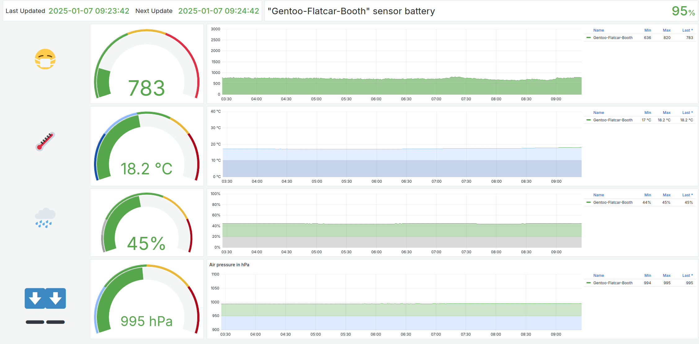

# Aranet Dashboard for FOSDEM booth

This includes a docker-compose file and set-up automation for the Gentoo / Flatcar booth Aranet4 CO2 dashboard.

The automation defaults to t-lo's Aranet4 device; edit the blueetooth MAC in `config.env` to use a different one.
You can also specify multiple devices there, and even name them!

A start script is provided to set up local data storage volumes, pair the Aranet4 device(s) via bluetooth, and launch the dashboard.

## Set up

We'll need to add your Aranet4 MAC address(es) to `config.env`.

To see all nearby devices' MAC addresses, run
```
bluetoothctl
[bluetooth]# scan on
```
and then after a while (~30s)
```
[bluetooth]# devices
```
to produce a list of all devices found.
Take note of "Aranet4" devices to use the respective MAC addresses in `config.env`.
Optionally, give each sensor a meaningful name.

## Run

Run `./start.sh`. This will pair the Aranet4(s) if not paired yet, and start the dashboard.

The dashboard should now be available at [`http://localhost:3000`](http://localhost:3000).
There's also a Prometheus metrics endpoint available at [`http://localhost:9090`](http://localhost:9090) which you can share with others to provide access to your CO2 data across the network.

## Modify dashboards

In order to change / modify / extend dashboards, you need to log in to Grafana.
Use the admin username / password defined in `config.env` - defaults are "dashboard" / "dashboard".

After modifying / saving dashboards you may export the updated dashboard's JSON via the "dashboard share" feature.
Replace the contents of `dashboared.json` in the repository root with the updated JSON to make your modified dashboard the default one.


